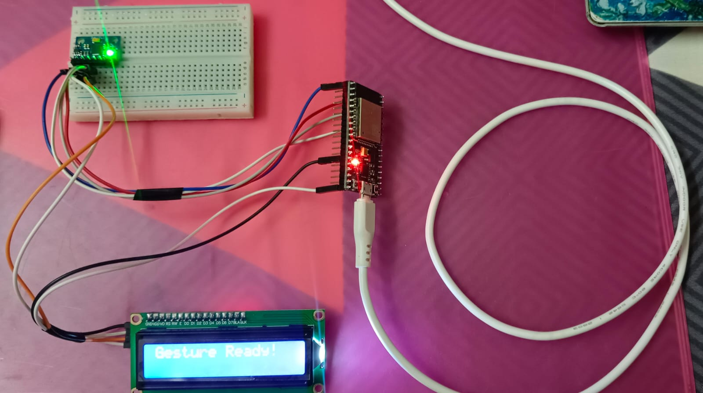
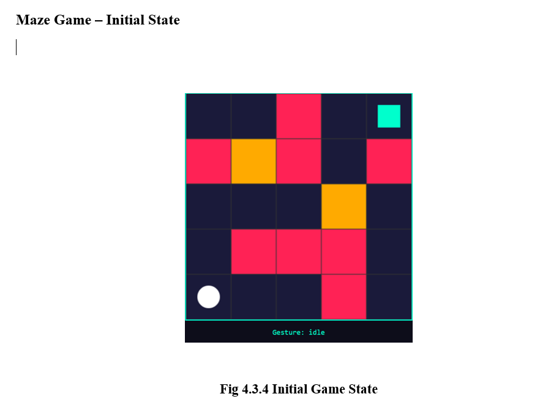
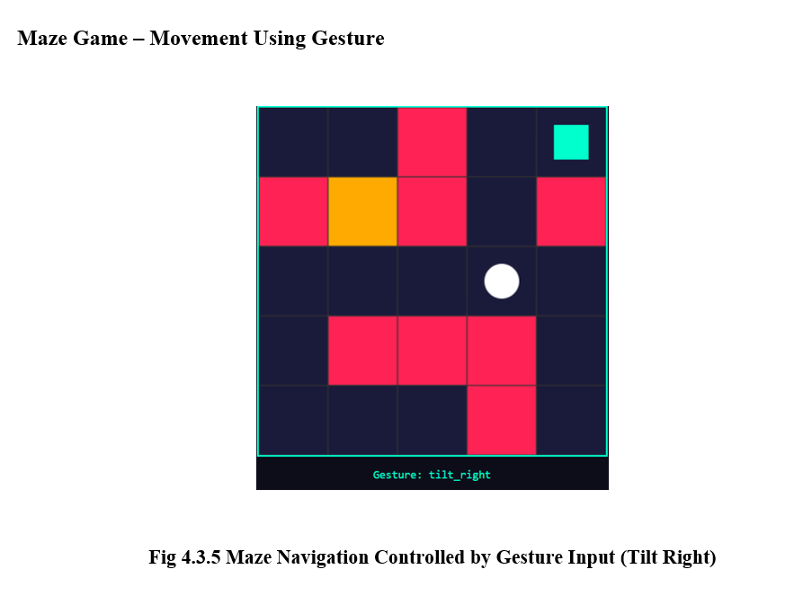
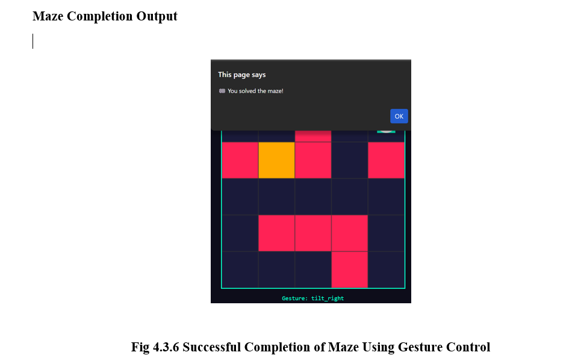

# AI Gesture-Controlled Maze Game

A real-time gesture-controlled maze game that uses an ESP32 with an MPU6050 motion sensor and a deep learning model to recognize hand gestures. The detected gestures are transmitted via WebSockets to control a browser-based maze game.

---

## Features

-  Real-time gesture recognition using ESP32 + MPU6050
-  Deep Learning gesture classification using TensorFlow/Keras (1D CNN)
-  WebSocket communication between Python backend and browser
-  Browser-based interactive maze game
-  Breakable obstacles using gesture commands
-  Keyboard demo mode for testing without hardware

---

## 🛠️ Tech Stack

### Hardware
- ESP32
- MPU6050 Accelerometer & Gyroscope

### Software
- Python
- TensorFlow / Keras
- NumPy
- Pandas
- Scikit-learn
- PySerial
- WebSockets
- HTML5 Canvas
- JavaScript

---

##  Project Structure

```
.
├── collect_data.py          # Collect gesture dataset from ESP32
├── gesture_data.csv         # Training dataset
├── train_model.py           # Train CNN gesture recognition model
├── gesture_model.h5         # Trained deep learning model
├── realtime.py              # Real-time gesture prediction
├── gesture_ws_bridge.py     # WebSocket bridge between model and browser
├── maze.html                # Browser-based maze game
├── label_encoder.pkl        # Saved label encoder (generated after training)
└── README.md
```

---

##  Supported Gestures

| Gesture | Action |
|---------|--------|
| Tilt Left | Move Left |
| Tilt Right | Move Right |
| Flick Up | Move Up |
| Shake | Break Nearby Wall |

---

##  Workflow

1. Collect gesture samples using the ESP32.
2. Save sensor readings into a CSV dataset.
3. Train the CNN model.
4. Save the trained model and label encoder.
5. Run the WebSocket bridge.
6. Open the maze game in a browser.
7. Perform gestures to navigate through the maze.

```
ESP32 + MPU6050
        │
        ▼
collect_data.py
        │
        ▼
gesture_data.csv
        │
        ▼
train_model.py
        │
        ▼
gesture_model.h5
        │
        ▼
gesture_ws_bridge.py
        │
        ▼
WebSocket Server
        │
        ▼
maze.html
```

---
## Hardware Setup

*ESP32 connected to the MPU6050 sensor.*

### Initial State
Player starts at the bottom-left corner of the maze.


### Wall Breaking

The **Shake** gesture breaks nearby breakable walls.

### Goal Reached
The player reaches the goal and wins the game.


---

##  Installation

Install dependencies:

```bash
pip install tensorflow numpy pandas matplotlib scikit-learn pyserial websockets joblib
```

---

##  Running the Project

### Step 1: Collect Dataset

```bash
python collect_data.py
```

---

### Step 2: Train Model

```bash
python train_model.py
```

---

### Step 3: Start Gesture Server

```bash
python gesture_ws_bridge.py
```

or run in demo mode

```bash
python gesture_ws_bridge.py --demo
```

---

### Step 4: Open Game

Open

```
maze.html
```

in your browser.

---

##  Controls

### Hardware Mode

Move your hand to perform gestures.

### Demo Mode

| Key | Action |
|-----|--------|
| A | Tilt Left |
| D | Tilt Right |
| W | Flick Up |
| S | Shake |
| Space | Idle |

---

##  Deep Learning Model

- Model: 1D Convolutional Neural Network (CNN)
- Input Shape: 50 × 3
- Optimizer: Adam
- Loss Function: Categorical Crossentropy
- Output Classes:
  - Shake
  - Tilt Left
  - Tilt Right
  - Flick Up

---

##  Dataset

Each sample contains:

- 50 sequential MPU6050 readings
- X-axis acceleration
- Y-axis acceleration
- Z-axis acceleration
- Gesture label

---

##  Future Improvements

- More gesture classes
- Dynamic maze generation
- Scoreboard and timer
- Mobile browser support
- Multiplayer mode
- Improved gesture accuracy using LSTM or Transformers

---

##  License

This project is for educational and research purposes.

---

##  Author

**Shanmuga Priya**

Developed as a Machine Learning + IoT + Web Technologies project integrating deep learning, real-time sensor data processing, and browser-based interactive gaming.
